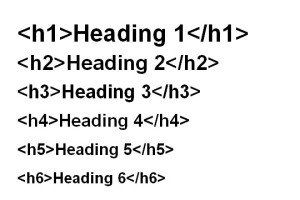

# Nagłówki i paragrafy czyli praca z tekstem

## Nagłówki `<h1></h1>`

Sekcja ta podzielona jest na 6 z czego każda różni się tylko i wyłącznie wielkością czcionki.

Jak zobaczycie zaraz na grafice im mniejsza liczba przy literze `h` tym większy nagłówek

Jak widać na obrazku deklaracja znacznika odpowiadającego za nagłówek to `<h*></h*>` gdzie zamiast `*` wpisujemy cyfrę od **1-6**.

**Zapamiętaj**

**W przypadku nagłówków został opisany nieforamlny standard, iż na jedną stronę może przypadać tylko jeden nagłówek formatu `<h1>`. Pozostałe mogą się dowolnie powielać.**

## Paragrafy / Akapity `

`

Paragrafy tworzymy za pomocą znaczników `

` te w przeciweństwie do `<h*>` nie zmieniają swojej wielkości czcionki w zależności od cyfry. Domyślnie są stałe i ustawiają czcionke wewnątrz wg domyślnej jaka przypada na daną przeglądrkę - około 16px.

## Przejście do kolejnej linii tekstu ` `

` ` z ang. line break - przełamanie linii. Elemnt ten nie posiada znacznika zamykającego. Po wstawieniu go do tekstu lub na jego koniec, dajemy znać przeglądarce, iż ma ona wyświetlić tekst w nowej linii.

## Linia horyzontalna `
`

Linia horyzontalna jest również samodomykającym się znacznikiem. Po wstawieniu ów znacznika na stronie pojawi się pozioma linia która oddzielać będzie to co nad i pod nią. Przy wstawieniu `
` między tekst, spowoduje ona przedzielenie go i wyświetlenie jego dalszej części po wstawionej linii.

Aby zobaczyć przykładowy szkielet strony z wykorzystaniem powyższych tagów  [kliknij tutaj](https://jsfiddle.net/LordSanTi92/bckf3wtc/2)
